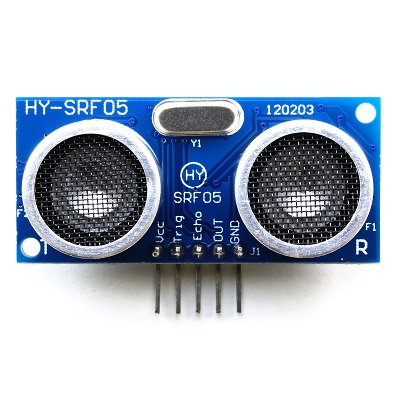
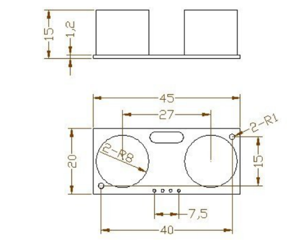
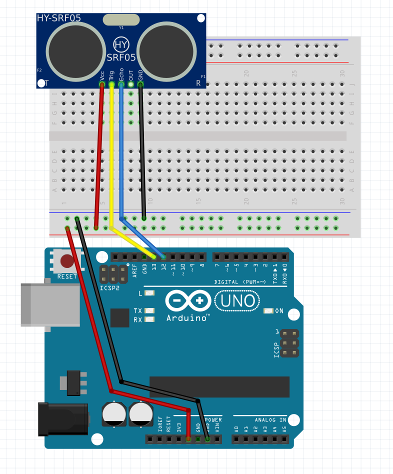
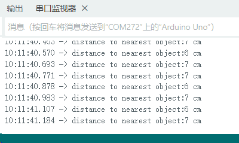

# KY0126 HY-SRF05超声波传感器



**本教程仅作为本产品使用的展示，不对具体开发提供实际参考，请结合实际规范使用。**

## 1、产品介绍

超声波传感器可以用于测量到物体的距离，并将结果发送到串口。它的长度范围从2厘米到3米不等。它测量信号到达物体并返回传感器所需的时间。

## 2、产品参数

| 参数             | 值           |
| ---------------- | ------------ |
| **工作电压**     | 5V（DC）     |
| **工作电流**     | <15mA        |
| **测量范围**     | 2cm ～ 300cm |
| **测量精度**     | ±3mm         |
| **发射频率**     | 40kHz        |
| **工作温度范围** | -15℃ ～ +70℃ |
| **重量**         | 10g          |



## 3、产品接线

| HY-SRF05 |     Arduino UNO      |
| :------: | :------------------: |
|   Vcc    |         5 V          |
|   Trig   | pin 13 (digital pin) |
|   Echo   | pin 12 (digital pin) |
|   Out    |    空置（不接线）    |
|   GND    |         GND          |



本产品兼容ESP32、ESP8266、树莓派pico、STM32、C51等单片机，这里以Arduino UNO为例。

## 4、测试代码

```c++
const unsigned int TRIG_PIN=13;
const unsigned int ECHO_PIN=12;
const unsigned int BAUD_RATE=9600;

void setup() {
  pinMode(TRIG_PIN, OUTPUT);
  pinMode(ECHO_PIN, INPUT);
  Serial.begin(BAUD_RATE);
}

void loop() {
  digitalWrite(TRIG_PIN, LOW);
  delayMicroseconds(2);
  digitalWrite(TRIG_PIN, HIGH);
  delayMicroseconds(10);
  digitalWrite(TRIG_PIN, LOW);
  
  const unsigned long duration= pulseIn(ECHO_PIN, HIGH);
  int distance= duration/29/2;
  
  if(duration==0){
    Serial.println("Warning: no pulse from sensor");
  }
  else{
    Serial.print("distance to nearest object:");
    Serial.print(distance);
    Serial.println(" cm");
  }
  
  delay(100);
}
```

## 5、实验结果

将超声波传感器连接到Arduino主板后，上传以上代码，打开Arduino IDE的串口监视器，可以看到串口监视器实时打印出测得的距离，如下图：



## 6、操作注意事项

1、本产品要求按照在产品规定的参数内进行操作，如电压要求DC5V,如果接入了超过5V的电压就会造成不可逆不可修复的损坏；

2、本产品要求在干燥的环境中使用，阴暗潮湿的环境会造成元件短路；

